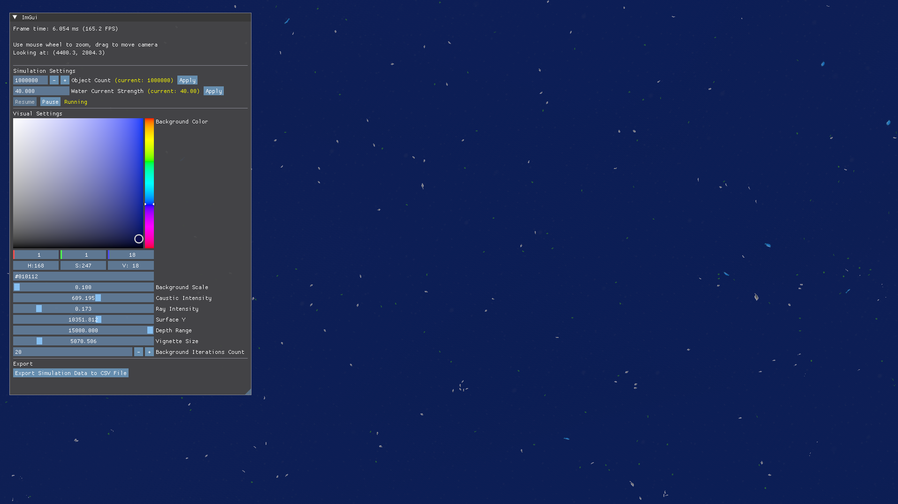
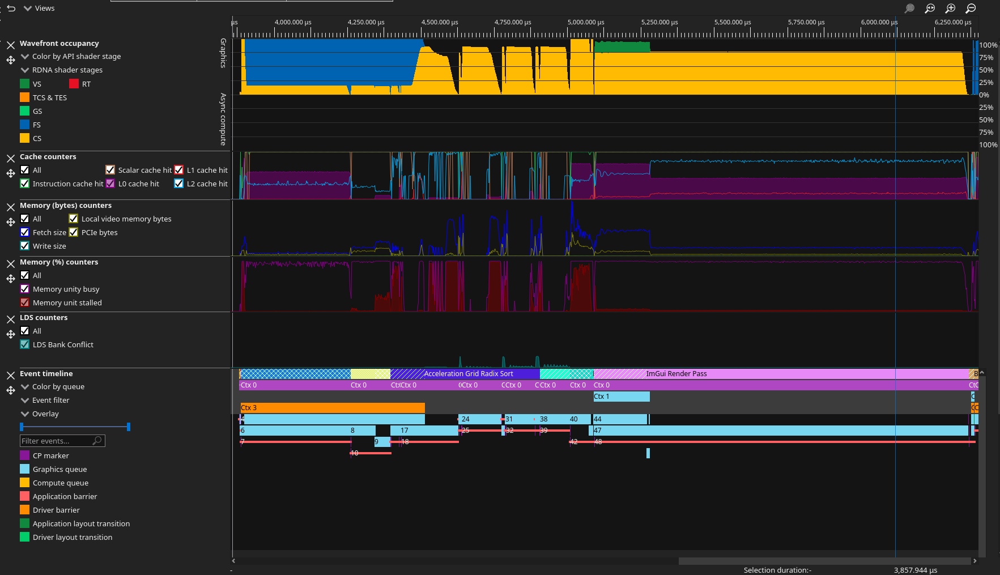

# Programowanie Obiektowe Projekt



## Objective

The goal of the project is for students to create a simple agent-based simulation using object-oriented design techniques. By simulation, we mean a program that models a selected segment of reality, specifically objects and the interactions between them. We will "set this model in motion" using randomly generated events that force objects to perform various actions (interact with other objects, change their internal state, etc.).
As an example, let's consider a simulation of the life of a colony of different types of organisms (herbivores, omnivores, carnivores). Each group of organisms has different properties and behavioral patterns. These organisms can move (randomly) around a board of given dimensions. Each board square can contain some kind of resource (food). The simulation begins by creating a random board with resources. Then, we place randomly generated organisms on it. At each step of the simulation, the organism moves a specific number of squares. During its journey, it can find resources, encounter other organisms, and interact with them.
The project created by students should allow for the setting of various initial parameters for the running simulation. Furthermore, data for each epoch (e.g., population size) should be collected during the simulation. After the simulation is completed, this data should be saved in some way, e.g., as a CSV file.


## Dependencies
### Required
- Compiler with support for C++ 23
- Slang compiler version v2026.6.1 or later
- VulkanSDK (graphics API)
- glm (math)
- SDL3 (window handling)
### Fetched
- VMA (vulkan memory allocator)
- xxhash (hashing)
- ktx (texture format)
- ImGUI (graphical interface)
- tinygltf (3d model parsing)

## How to run?
> [!NOTE]
> Project was confirmed to compile and work under Windows and Linux (MacOS should also work with possible slight fixes to the code).
```
git clone https://github.com/Genkunen/ProgramowanieObiektoweProjekt
cd ProgramowanieObiektoweProjekt
mkdir build && cd build
cmake ..
cmake --build . && ./main
```
It's highly recommended to use multithreaded builds using either ninja or -j$(nproc) flag:
```
cmake .. -GNinja
or
cmake .. -j$(nproc)
```
Project is optimized under clang++ 22.1.*, so it's recommended to use clang to compile it, though it was also compiled succesfully with MSVC and GCC. To hint CMake to use clang, its enough to pass those flags to `cmake ..` command:
```
-DCMAKE_CXX_COMPILER=clang++ -DCMAKE_C_COMPILER=clang
```

## Focus
The project focuses on the following aspects:
- Performance: Simulating a huge number of objects in realtime, having interactions between each, within a constantly changing environment.
- High-performance GPU programming: Using specialized GPU operations such as local data share operations and wave intrinsics
    for highly efficient computations. Using the profiler to find bottlenecks and optimize the code. In our scenario, we made extensive
    use of the [Radeon GPU Profiler](https://gpuopen.com/rgp/).
- Building a fully GPU-driven simulation: Using the GPU to render the scene and to compute the interactions between objects without any
    round-trips to the CPU for simulation steps.
- Using modern graphics APIs: Using Vulkan for rendering and compute.
- Applying OOP principles: Using classes to encapsulate objects' components and to organize the code, abstracting low-level Vulkan details
    away from rendering and user logic, using polymorphism to implement a shared interface for render graph passes.
- Abstracting low-level Vulkan details such as synchronization away from render graph passes.

## Overview in Radeon GPU Profiler
The following capture was made using Mesa RADV 26.1.0, on a NAVI31 chip, displayed using Radeon GPU Profiler V2.6.1.12. At the time of capture, about 1000000 objects were being both simulated and drawn.

*note: debug labels might not be accurate due to RADV+RGP shenanigans*

## Current State
Objects:
- plants that do nothing but follow constantly present water current,
- fish that eat the plants and may eat other fish,
- predators that only eat fish.

The number of objects can be changed in the GUI panel, by specifying a new number and clicking the Apply button alongside the input.
The strength of the water current inside the aquarium is randomized depending on the position (e.g. it is a noise algorithm as a vector field). The strength of the current can be changed in the same GUI panel and then clicking the Apply button alongside it.
The simulation can be paused and resumed by the respective buttons in the GUI panel.
<br>
You can move the camera around the aquarium by dragging the mouse and using the scroll wheel to zoom in and out.
The visuals of the aquarium can be changed by changing the shader parameters in the GUI panel.
<br>
The simulation implementation splits the aquarium space into a spatial hash grid, and within each cell of the grid, objects simulate interactions with the objects present in the same grid cell and eight neighboring cells around it.
Because of GPU LDS memory limitations, up to 64 objects are considered in a single cell.
<br>

Current testing showed promising results in up to 1,000,000 objects on intel and AMD **integrated** laptop GPUs and over 10,000,000 objects on a dedicated AMD GPU, maintaining a steady 60+ FPS (below 16ms per frame).